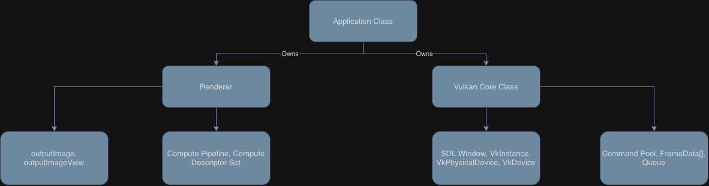

# Vk-Raytracer
Vulkan raytracer

This is a personal project following the CPU based ray tracing listed out in Peter Shirley's books, as well as to learn Vulkans Graphics API.

## Dependencies
- SDL3
- VulkanMemoryAllocator
- GLM
- Vulkan SDK
- CMake version 3.2+

## Todo
- GUI using IMGUI.
- Ability to load OBJ.
- Additional ray tracing features, e.g. better diffuse, reflections, glass etc.
- Benchmarking across multiple GPUs, using compute shaders and Vulkans ray tracing pipeline.
- Benchmarking across rendering techniques.

## Architecture

## Thoughts
- Currently, the program uses Vulkan's `compute shader` to calculate the paths and the pixels for the rays, I would like to eventually extend this to use `VK_KHR_ray_tracing_pipeline` extension.
- Additionally, seeing how to use CUDA could provide an interesting benchmark.

## Benchmarking
- Check back later.

## Resources
- Thanks to Sebastian Lagues series on Ray Tracing and Peter Shirley's Ray tracing trilogy. 

## Vulkan Specific
(Computer Graphics TU Wien Series)[https://www.youtube.com/watch?v=5VBVWCg7riQ]  
(constref Vulkan in 2 Hours)[https://www.youtube.com/watch?v=DC9FBRQKNck]  
(Introduction to Vulkan Compute Shaders)[https://www.youtube.com/watch?v=KN9nHo9kvZs]  
(Vulkan Tutorial)[https://vulkan-tutorial.com/]  
(Real Time RayTracing)[https://developer.nvidia.com/blog/vulkan-raytracing]  

