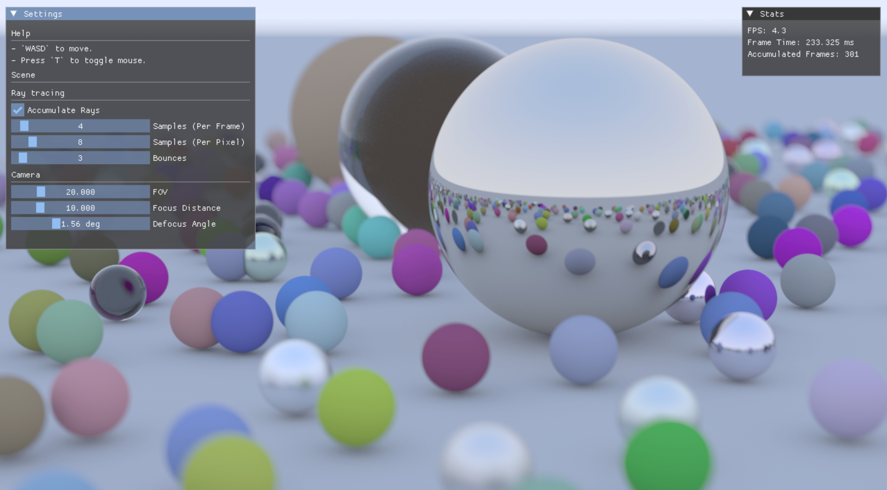
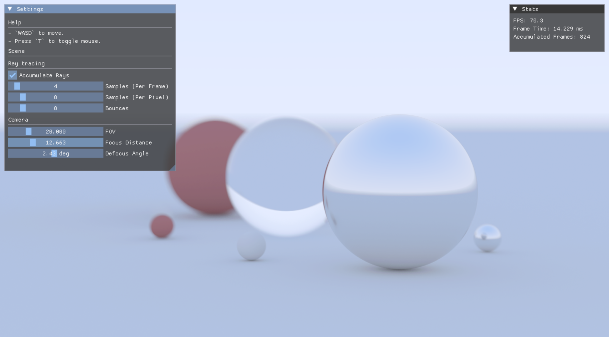
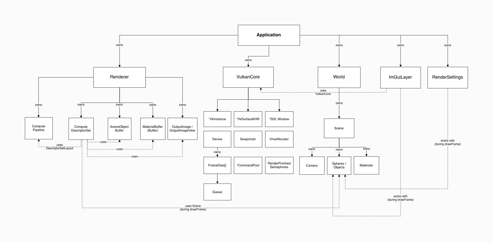

# Vk-Raytracer
Vulkan raytracer

This is a personal project following the CPU based ray tracing listed out in Peter Shirley's books, as well as to learn Vulkans Graphics API.

## Dependencies
- SDL3
- VulkanMemoryAllocator
- GLM
- Vulkan SDK
- CMake version 3.2+

## Todo
- Ability to load OBJ.
- Benchmarking.

## Architecture
- Setting up the Vulkan pipeline was probably the most tedious and complicated part of this whole project, I made a great deal to separate each of it's setup components into separate objects so that they are easy to understand when used together but it is still not yet fully resolved. I've made diagrams to reason about the design of the setup and understand the relations between each component as I was developing.

- The objects with `*` next to them indicate Vulkan objects.

## Thoughts/Updates
12/09
- Currently, the program uses Vulkan's `compute shader` to calculate the paths and the pixels for the rays, I would like to eventually extend this to use `VK_KHR_ray_tracing_pipeline` extension.
- Keeping the camera class on the CPU was actually a better choice, it avoids having most camera calculations which usually runs one per frame being run for every pixel saving alot of resources, the result of keeping the camera on the CPU is that it sends 64-100 bytes of data per frame which is insignificant to the shaders dispatching millions of invocations.
20/09
- Currently, there is alot of screen tearing when moving the camera, the setup chooses FIFO mode when Vulkan is initialized which may be part of the problem, additionally, many image transitions are used in the rendering process which could also contribute to delayed frame swaps.
22/09
- The frame rate is absolutely atrocious to say the least, progressive accumulation of rays is probably done for a reason.
- The shader currently uses a brute force intersection loop for every object in the scene, every bounce of a ray check every sphere which is bad.
26/09
- Accumulation done. Performance improved drastically, before using 64 samples per pixel caused the frame rate to drop to around 5-10 FPS but now with accumulated sampling, a stable 60 FPS remains while the quality is still decent.
## Benchmarking
- Check back later.

## Resources
- Thanks to Sebastian Lague's series on Ray Tracing and Peter Shirley's Ray tracing trilogy. 

### Vulkan Specific
(Computer Graphics TU Wien Series)[https://www.youtube.com/watch?v=5VBVWCg7riQ]  
(constref Vulkan in 2 Hours)[https://www.youtube.com/watch?v=DC9FBRQKNck]  
(Introduction to Vulkan Compute Shaders)[https://www.youtube.com/watch?v=KN9nHo9kvZs]  
(Vulkan Tutorial)[https://vulkan-tutorial.com/]  
(Real Time RayTracing)[https://developer.nvidia.com/blog/vulkan-raytracing]  

