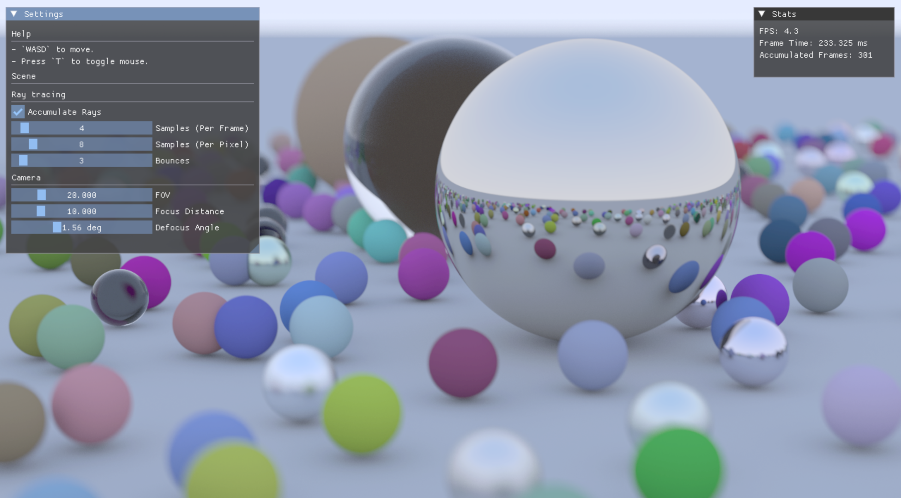
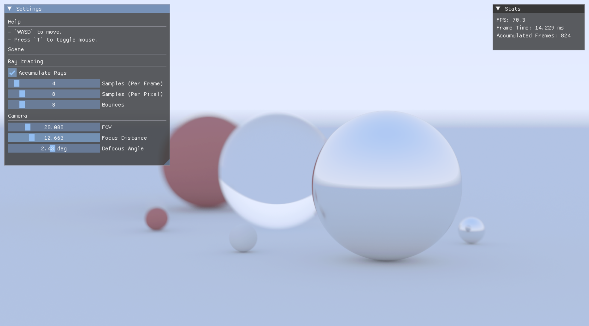
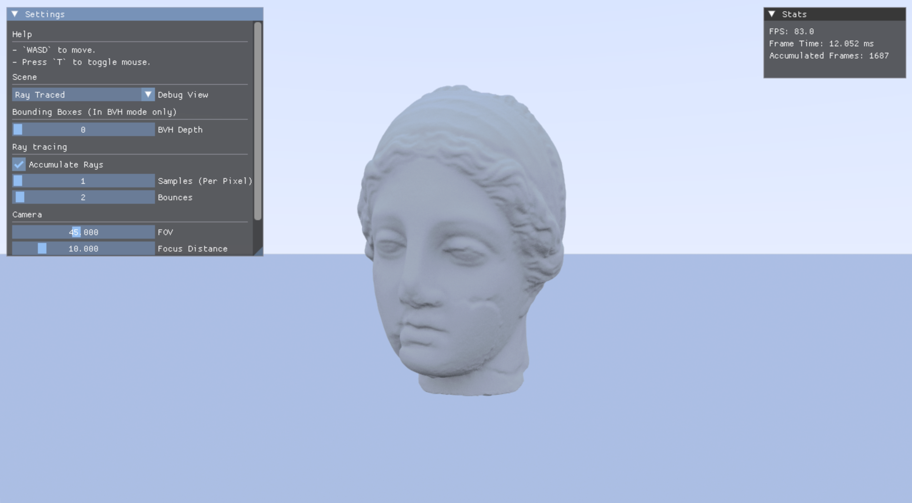
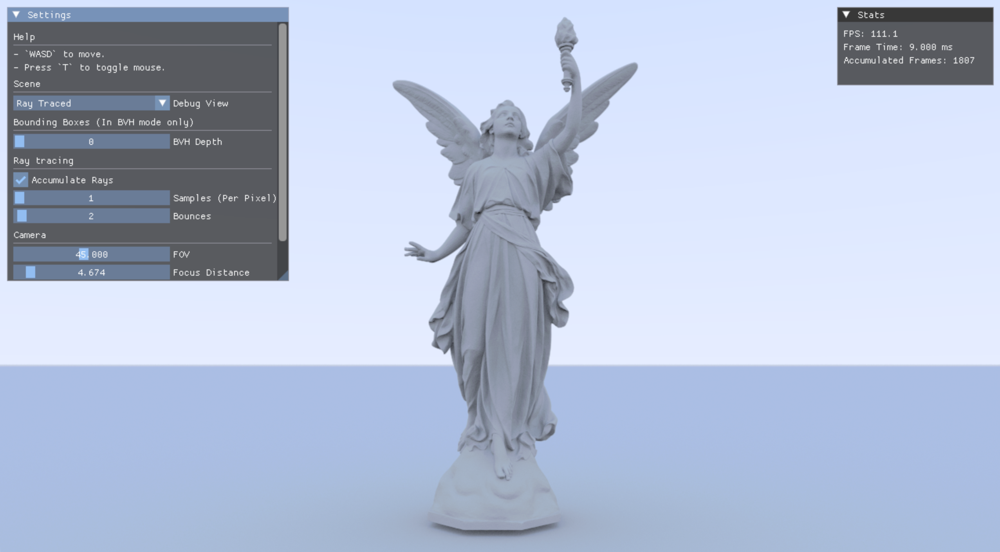
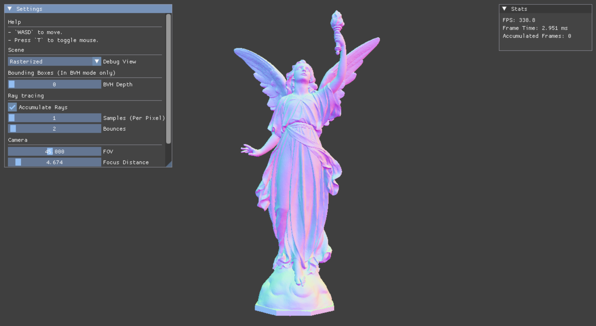
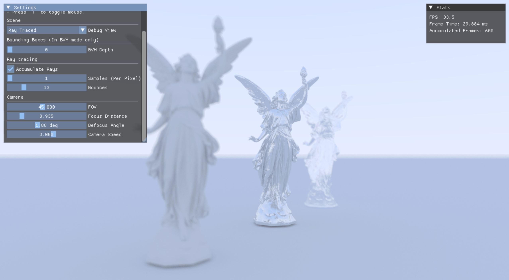
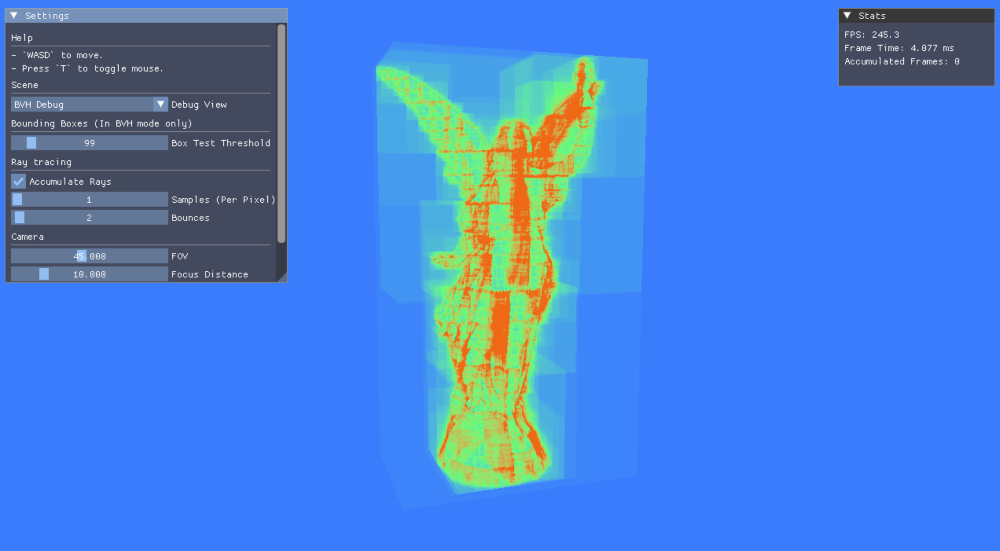
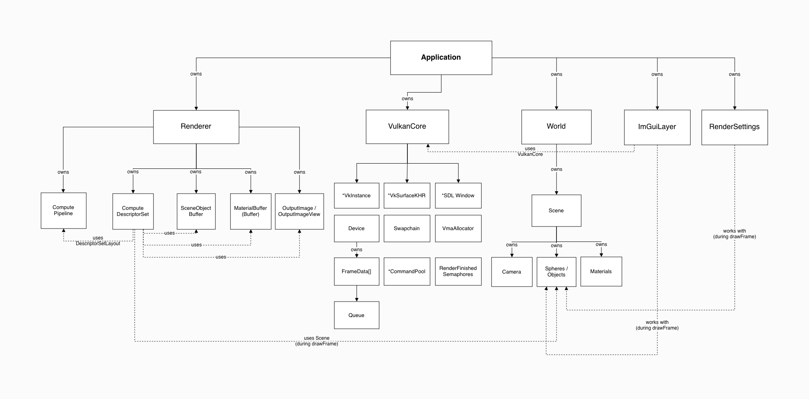

# Vk-Raytracer
Vulkan raytracer

This is a personal project following the techniques listed CPU based ray tracing listed out in Peter Shirley's books, while using the Vulkan specification.

## Gallery















## Dependencies
- SDL3
- VulkanMemoryAllocator
- GLM
- Vulkan SDK
- CMake version 3.2+

## Todo
- Benchmarking.
- Add bounce count, normals, material ID views and bounding box views and nodes.
- Add light sources and texture mapping.

## Usage
- To build the program, use `build.sh` from the root directory;
```
build.sh
```
- Alternatively, use run cmake from the directory;
```
cmake -S . -B build
cmake --build build
```
- Ignore the current `run.sh` script, it was only used for debugging.
- To run the ray tracer, run it from the root directory using the format `./build/Vk-Raytracer <model-name>`, e.g. `./build/Vk-Raytracer spheres`.
- Some supplied scene names are listed below;
```
spheres
oneWeekend
igea
lucy
teapot
suzanne
lucies
```

## Architecture
- Setting up the Vulkan pipeline was probably the most tedious and complicated part of this whole project, I made a great deal to separate each of it's setup components into separate objects so that they are easy to understand when used together but it is still not yet fully resolved. I've made diagrams to reason about the design of the setup and understand the relations between each component as I was developing.



- The objects with `*` next to them indicate Vulkan objects.

## Thoughts/Updates
12/09. 
- Currently, the program uses Vulkan's `compute shader` to calculate the paths and the pixels for the rays, I would like to eventually extend this to use `VK_KHR_ray_tracing_pipeline` extension.
- Keeping the camera class on the CPU was actually a better choice, it avoids having most camera calculations which usually runs one per frame being run for every pixel saving alot of resources, the result of keeping the camera on the CPU is that it sends 64-100 bytes of data per frame which is insignificant to the shaders dispatching millions of invocations.  
20/09. 
- Currently, there is alot of screen tearing when moving the camera, the setup chooses FIFO mode when Vulkan is initialized which may be part of the problem, additionally, many image transitions are used in the rendering process which could also contribute to delayed frame swaps.  
22/09. 
- The frame rate is absolutely atrocious to say the least, progressive accumulation of rays is probably done for a reason.
- The shader currently uses a brute force intersection loop for every object in the scene, every bounce of a ray check every sphere.  
25/09. 
- Accumulation done. Performance improved drastically, before using 64 samples per pixel caused the frame rate to drop to around 5-10 FPS but now with accumulated sampling, a stable 60 FPS remains while the quality is still decent.  
26/09. 
- Implemented Moller Trumbore algorithm for triangle intersection.  
- Added OBJ file loading.  
- Testing the frame rate for simple models with triangles, e.g. Suzanne is low, around 3 fps with 2 bounces and 2 samples per pixel.  
- I've decided to separate my BVH implementation to construct the nodes on the CPU using recursion and use a flat array of GPU friendly nodes when used.  
- After implementing a simple BVH, the fps jumped all the way from around 15 to 200 for a simple model such as Suzanne, interesting to visually see the difference of O(n) and O log(n) time and realize bow much faster log(n) is for large numbers of n.  
28/09.  
- Currently, the BVH construction algorithm is done in the CPU with recursion, for a model with around 260k triangles, the construction time is noticeably slow, however perhaps an iterative approach on the GPU could be faster?
## Benchmarking
- Check back later.

## Resources
- Thanks to Sebastian Lague's series on Ray Tracing and Peter Shirley's Ray tracing trilogy. 

### Vulkan Specific
(Computer Graphics TU Wien Series)[https://www.youtube.com/watch?v=5VBVWCg7riQ]  
(constref Vulkan in 2 Hours)[https://www.youtube.com/watch?v=DC9FBRQKNck]  
(Introduction to Vulkan Compute Shaders)[https://www.youtube.com/watch?v=KN9nHo9kvZs]  
(Vulkan Tutorial)[https://vulkan-tutorial.com/]  
(Real Time RayTracing)[https://developer.nvidia.com/blog/vulkan-raytracing]  
(Triangle Intersection)[https://www.scratchapixel.com/lessons/3d-basic-rendering/ray-tracing-rendering-a-triangle//moller-trumbore-ray-triangle-intersection.html]  
(3D models)[https://graphics.stanford.edu/data/3Dscanrep/]
(BVH)[https://jacco.ompf2.com/2022/04/13/how-to-build-a-bvh-part-1-basics/]